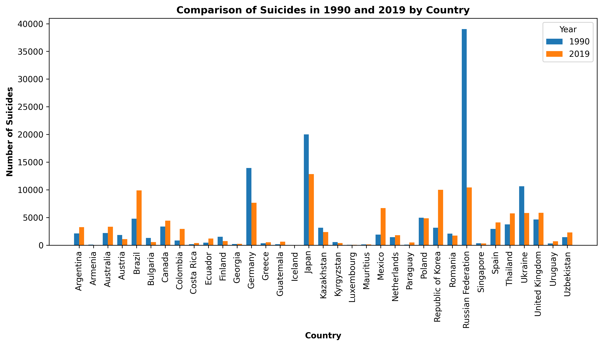
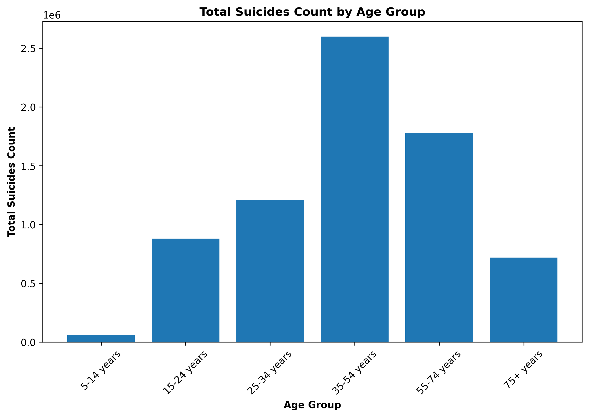
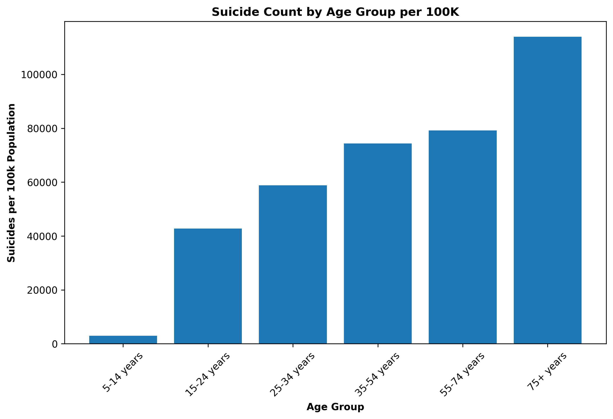
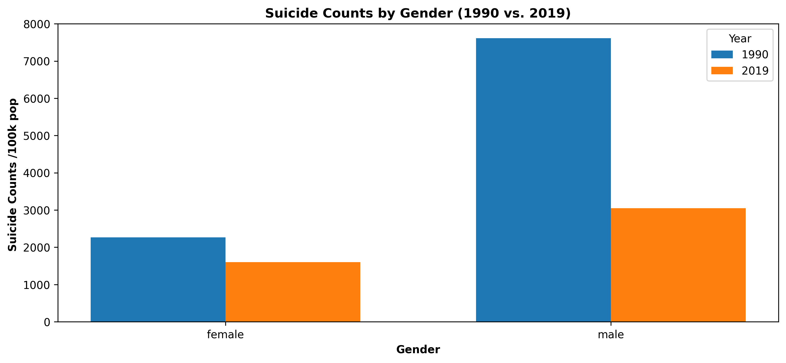
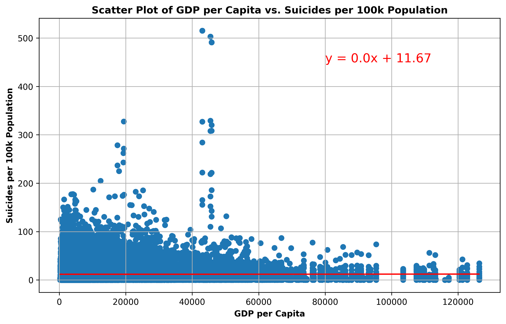

# Exploring Suicide Rates and Factors Over 1990 - 2019

## Collaborators: 
- Dalya Lami
- Ali Alam
- Jahn Ferdinandus
- Dayana Imanova

## Table of Contents

- [About](#about)
- [Getting Started](#getting-started)
- [Installing](#installing)
- [Analysis](#analysis)
- [References](#references)

## About
This research project seeks to comprehensively investigate suicide rates and their underlying factors over the period from 1985 to 2020. It aims to shed light on the complex dynamics surrounding suicide, offering valuable insights to inform prevention and support efforts.

### Research Goals

1) Explore the correlation between suicide rates and geographical regions by comparing suicide rates across 58 different countries.

2) Identify the age groups most susceptible to suicide.

3) Analyze the relationship between suicide rates and gender by comparing suicide rates between countries in 1990 and 2019.

4) Examine the correlation between GDP per capita and suicide rates in various countries.
   
5) Visualize the relationship between the percentage of government expenditure and suicide rates per 100k population for the year 2011.

## Getting started

### Prerequisites
Before you begin, ensure you have the following installed:
- Python 3.x
- Jupyter Notebook
- Required Python packages (NumPy, Pandas, Matplotlib, Pathlib)

## Installing

Install the necessary packages and download the repository files. You would need the main_file.ipynb and the resourses folder. 

## Analysis

### Number of Suicides per Country (1990 vs. 2019)
We employed a bar graph to visually represent the number of suicides in each country for two critical years: 1990 and 2019. This analysis offers essential insights into the evolving landscape of suicide rates over the two decades.
#### High Suicide Rates in 1990:
- Countries such as Germany, Japan, Russia, and Ukraine exhibited notably high suicide rates in 1990. This observation reflects the challenges these nations faced in addressing mental health and suicide prevention during that period.
#### Changes in Suicide Rates:
- Contrasting this, it's important to highlight countries like Brazil, Mexico, South Korea, and the United Kingdom. These countries have experienced an increase in their suicide rates by the year 2019.
  

#### Overall Trends:
- One notable trend emerging from this analysis is the reduction in the overall number of suicides between 1990 and 2019. This reduction is indicative of potential progress in suicide prevention and mental health support strategies over the years.
In both hemispheres, Latitude is a significant predictor of Max Temperature, with clear linear trends.

### Analysis of Total Suicides by Age Group:
In the first graph, which represents the total number of suicides in each age group, we observe the following:
- The age group with the highest number of suicides is between 35 and 54 years. This age category shows the highest count of suicides, indicating a critical age range for suicide prevention efforts.
- Following closely is the age group between 55 and 74 years, with the second-highest number of suicides. This highlights the significance of addressing mental health concerns in this age range.

### Analysis of Suicides per 100,000 Population by Age Group:
In the second graph, which represents suicides per 100,000 population in each age group, the observations are different:
- The age group with the highest rate of suicides per 100,000 population is the "75+ years" category. This indicates a higher risk of suicide for individuals in this age group when considering population size.
- The second-highest rate of suicides per 100,000 population is in the "55-74 years" age bracket. This finding emphasizes that, when adjusted for population size, middle-aged and early elderly individuals face a relatively higher risk of suicide.

### Analysis of Total Suicides by Gender:
In this analysis, we employed a pie chart to provide a clear visual representation of the distribution of total suicides by gender. This examination allows for a straightforward comparison of suicide counts between males and females.
#### Men significantly outnumber women in suicide cases:
- The pie chart reveals a striking gender imbalance in suicide rates. Males account for a substantial majority, representing approximately 76.5% of the total suicides.
- Conversely, females constitute a smaller portion of the total suicides, accounting for approximately 23.5%. This percentage is notably lower compared to males.

A key observation is that males have approximately three times the number of suicides compared to females. This significant gender disparity underscores the need for gender-specific approaches in suicide prevention efforts.

### Analysis of Total Suicides per 100k Population by Gender (1990 vs. 2019):
In this analysis, we employed a bar graph to examine the total suicides per 100k population for males and females in both 1990 and 2019. This visual comparison allows us to identify gender-specific trends in suicide rates over the two decades.
#### Suicide Rates in 1990 (per 100k population):
- For males in 1990, the suicide rate was a little over 2000, indicating a significant number of suicides in this gender group.
- For females in 1990, the suicide rate was approximately 1600, reflecting a substantial but relatively lower number of suicides compared to males.
#### Suicide Rates in 2019 (per 100k population):
In 2019, there has been a notable increase in suicide rates for both genders.
- For males in 2019, the suicide rate has risen to almost 8000 per 100k population, signifying a considerable surge in suicides among males over the years.
- For females in 2019, the suicide rate has also increased, exceeding 3000 per 100k population, which is significantly higher compared to 1990.

### Analysis of GDP per Capita vs. Suicides per 100k Population:
This scatter plot examines the relationship between GDP per capita and suicide rates across about 40 countries. The goal is to identify trends and patterns in this relationship.
- Rising Suicide Rates with GDP Increase: Suicide rates tend to increase as GDP per capita rises from 20,000 to 45,000, indicating potential socioeconomic pressures.
- Stable Rates Beyond 45,000: Beyond a GDP per capita of approximately 45,000 to 50,000, suicide rates stabilize around 50 per 100k population.
- Outliers at High Income Levels: Some countries with high GDP per capita exhibit unexpectedly high suicide rates, emphasizing the role of non-economic factors.

  
While there's a general trend of increasing suicide rates with rising GDP per capita up to a point, this relationship is complex. Mental health support systems, cultural attitudes, and other factors also influence suicide rates.

### Analysis of the relationship between the Percentage of Government Expenditure and Suicide Rates per 100k Population for the year 2011:

## References
 - Dataset for [suicide_rates_1985 2021](https://www.kaggle.com/datasets/omkargowda/suicide-rates-overview-1985-to-2021)
 - Dataset for [Government expenditures on mental health as a percentage of total government expenditures on health (%)](https://www.who.int/data/gho/data/indicators/indicator-details/GHO/government-expenditures-on-mental-health-as-a-percentage-of-total-government-expenditures-on-health-(-))

